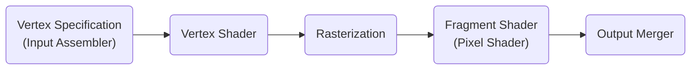

# Graphics Programming mit OpenGL

## Programmable Renderpipeline

```mermaid
	flowchart LR
	IA("Vertex Specification <br> (Input Assembler)") --> VS(Vertex Shader) --> RS(Rasterization) --> FS("Fragment Shader <br> (Pixel Shader)") --> OM(Output Merger)
```