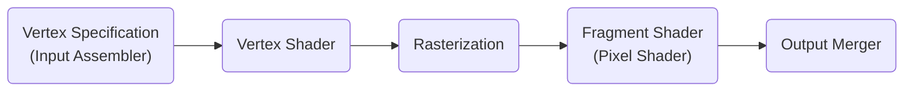
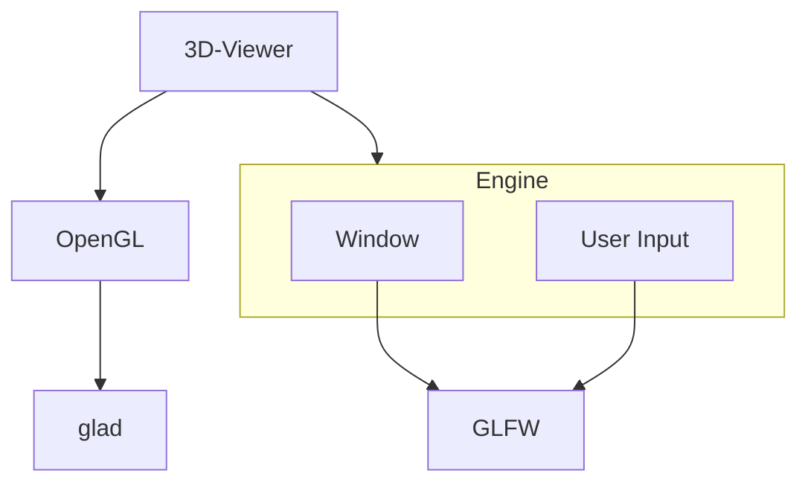

# Graphics Programming mit OpenGL

## Programmable Renderpipeline

## Dependencies

## Links
### package manager:
https://vcpkg.io

### Dependencies
https://www.glfw.org/  
https://glad.dav1d.de/ / https://vcpkg.io/en/package/glad  
### OpenGL Dokumentation:
https://docs.gl/
### C++
[C++ reference](https://en.cppreference.com/w/)  
[C++ Core Guidelines](https://isocpp.github.io/CppCoreGuidelines/CppCoreGuidelines.html)  
[Compiler Explorer](https://godbolt.org/)